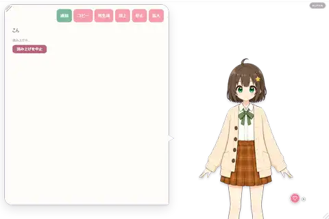
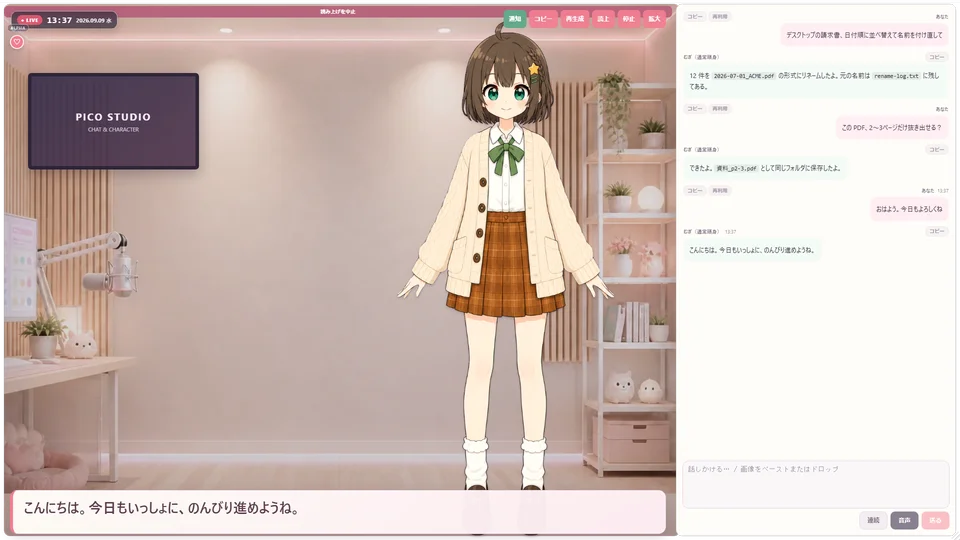
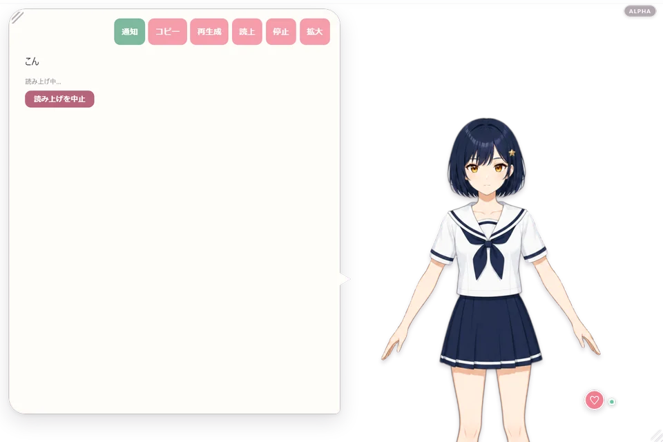
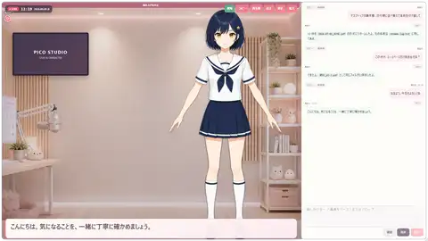

# PicoAgent v1.1.5 Alpha

PicoAgentは、キャラクターと会話しながらPC作業も手伝ってもらえるデスクトップペットです。付属の2Dキャラに加え、利用権を持つPNG／Live2Dモデルを追加できます。既定のローカルAIでは会話をPC内で処理します。

この公開サイトはこのリポジトリの`main`を正本とし、`main`へ反映すると同梱のGitHub Pagesワークフローが静的ファイルを配信します。本体リポジトリの`distribution/site`は編集正本にも同期元にもしません。

> [!WARNING]
> 現在公開しているものは**Windows版 PicoAgent v1.1.5 Alpha**と**macOS版 v1.0.4 Alpha**です。不具合、仕様変更、設定の互換性変更が入る可能性があります。大切なデータはバックアップし、試用目的でお使いください。Windows版は未署名のためSmartScreen警告が表示される場合があります。

> [!NOTE]
> **開発中のアルファ版として、PicoAgentのすべての機能を無料で公開しています。** 外部APIの利用料や、選択した追加コンポーネントの導入条件は別途適用されます。

## まず分かること

- **会話**: 既定のローカルAIなら、初回のモデル取得後は会話をPC内で処理できます。
- **仕事**: 74種のスキルから必要なものを選び、許可した範囲のPC作業を手伝います。
- **キャラクター**: 付属7体はまばたき・5母音の口パク・表情・待機動作に対応し、自分で用意したPNG／Live2Dモデルも追加できます。
- **表示負荷**: 付属キャラの表示中は画像生成を行わず、完成済みの透過PNGパーツを共通の2.5D描画層で動かします。

## 立ち絵からPicoAgentで動くまで

付属7体はキャラ別の専用処理ではなく、LocalVTuberStudioの同一パイプラインで制作しています。

```text
1枚の立ち絵
  → 背景分離
  → DINO/SAMで目・口・髪・顔・胴体などを原寸分解
  → 2.5Dリグ化
  → Qwen/ComfyUIで閉眼・隠れ顔・耳を局所補完
  → character.json + rig2d/parts/*.png の自己完結パック
  → PicoAgentへそのまま登録
  → 共通PIXI描画で、まばたき・5母音・表情・待機動作
```

各工程の成果物を保存してから次へ進むため、失敗した工程以降だけを再実行できます。原画は上書きせず、検査に通らない途中世代や空素材へ黙って切り替えません。現行パイプラインは付属7体で動作していますが、どの入力でもLive2D「ひより」と同等になる保証はまだありません。詳しい成果物と再生成方法は[PicoAgent本体READMEのパイプライン概要](https://github.com/benybeny777/PicoAgent#キャラクターができて動くまで)を参照してください。

## 技術スタック

| 領域 | 技術 | 用途 |
|---|---|---|
| アプリ | Tauri 2、Rust、WebView2 | Windowsデスクトップアプリ、設定、権限、ローカル処理の管理 |
| 2D/2.5D | PIXI.js、独自メッシュリグ | 完成済み透過PNGを連続変形して表示 |
| Live2D | Cubism Core、pixi-live2d-display | 利用者が追加したCubism 4／5モデルの表示 |
| ローカルAI・音声 | llama.cpp、whisper.cpp、AivisSpeech | 会話、文字起こし、読み上げをPC内で処理 |
| キャラクター制作 | Python 3.12、PyTorch、Grounding DINO、SAM 2.1 | 立ち絵の意味解析と原寸部位分解 |
| 局所補完 | ComfyUI、Qwen-Image-Edit-2511 | 目・隠れ顔・耳の必要範囲だけを補完 |

## 動画プレビュー

| 2Dキャラクター | Live2D表示例 |
|---|---|
|  |  |

Live2Dの「ひより」は動作例です。ほかのモデルは下の一覧でも比較できます。モデル素材はインストーラへ同梱していません。

### Live2D動作例

| ひより（通常／配信） | はる（通常／配信） | イプシロン（通常／配信） | まお（通常／配信） |
|---|---|---|---|
| <br> | <br> | <br> | <br> |

| ライス（通常／配信） | わんこ（通常／配信） |
|---|---|
| <br> | <br> |

各プレビューは通常表示と配信表示をLP用6秒・960px・16fpsで実画面から直接撮影しています。通常版は実画面を2倍密度で描画し、配信版はネイティブ1920×1080のフルHD画面から縮小しており、既存動画の再エンコードではありません。音声同期の口パクを十分見せてから、考え中、待機へ戻ります。ライスは元モデルに口パラメータがないため口パク非対応です。本作品のキャラクターには株式会社Live2Dの著作物が用いられています。利用前に[サンプルデータ利用条件](https://www.live2d.com/learn/sample/model-terms/)を確認してください。

## 付属キャラクター

| キャラクター | 通常表示 | 配信表示 |
|---|---|---|
| **むぎ** — 明るく寄り添う作業相棒 |  |  |
| **むぎ（通常頭身）** — 同じ人格の通常頭身2.5D |  |  |
| **りん** — 面倒見がいいツンデレ作業相棒 |  |  |
| **まい** — 包容力のあるやさしいお姉さん |  |  |
| **セナ** — 凛とした歌姫系作業相棒 |  |  |
| **あおい** — 冷静で好奇心旺盛な作業相棒 |  |  |
| **実写2Dテスト** — 同じ描画経路を検証する成人キャラクター |  |  |

全7体が、独立PNGパーツによる連続まばたき、母音に応じた2軸口パク、視線、表情、待機モーションに対応します。表示中は画像生成モデルを動かさず、PicoAgentの共通2.5D描画だけを使います。

低頭身2Dは上半身、長身・実写・Live2Dは胸全体がぎりぎり入る胸上、チャット／バーの小型アイコンは首上を初期構図にします。利用者が保存したキャラ別構図は初期値より優先します。

## 機能一覧

- テキスト／音声会話、読み上げ、口パク、まばたき、視線、表情、ふれあい、長期記憶
- 7つの表示形式（ペット／マスコット／LINE風チャット／バー／作業／配信／ウィジェット）、OBS風の直接配置、キャラやフキダシの位置・大きさ・背景保存
- 付属2Dキャラ、自作PNG、利用権を持つCubism 4／5 Live2Dモデルの追加
- 既定のローカルAIと、任意のクラウドAI／外部サービス連携
- 許可範囲を指定したファイル操作、予定、要約などの実務スキル74種
- 設定、会話履歴、追加キャラ、取得済みモデルを維持する更新経路

### できること（スキル74種）

| 分類 | 例 |
|---|---|
| 毎日の習慣 | 時刻、天気、目覚まし、リマインダー、集中タイマー、ToDo、今日のまとめ、ニュース、RSS、為替、株価 |
| ファイルと文書 | 読み書き、ファイル名／全文検索、作業フォルダ整理、PDF編集、Office文書、形式変換、画像確認・加工 |
| PC操作 | アプリ起動、ウィンドウ操作、クリップボード、コマンド実行、長時間ジョブ、予約実行（cron風）、コード実行 |
| Webと調べもの | Web検索、ページ取得、ブラウザ操作、調査レポート作成 |
| 連絡とタスク管理 | Gmail、Slack、Discord、GitHub、Notion、Jira、Linear、Trello、Todoist、Googleカレンダー／ドライブ／ドキュメント／スプレッドシート／ToDo、Microsoft Graph |
| SNS | X、Bluesky、Mastodon、Misskey、Reddit、LinkedIn |
| 音声と記録 | 会議の録音、ローカル文字起こし、議事録づくり |
| つくる | 画像生成、ComfyUI連携、制作ワークスペース |

スキルは会話の内容から自動で選ばれます。ファイル操作は許可した範囲だけを対象にし、削除に相当する操作は必ずOSのゴミ箱へ移します。外部サービスは、鍵やトークンを設定した分だけ有効になります。

### AIモデル

| 接続先 | 内容 |
|---|---|
| 同梱ローカルAI（既定） | 推論エンジンを同梱。初回だけモデルを取得し、以後はオフラインでも会話できます |
| Ollama | 既に導入済みのOllamaへ接続できます |
| 手元のCLIエージェント | Claude CodeやCodex CLIをそのまま接続先に指定できます。導入とログインは利用者が行います |
| クラウドAI（任意） | OpenAI、Anthropic（Claude）、Google Gemini、DeepSeek、xAI、Mistral、OpenAI互換API。各社の利用料が発生します |

APIキー等はWindowsのDPAPIで暗号化して保存し、同じWindowsユーザーだけが復号できます。

### 開発者向け（既定は無効）

- ローカルHTTP API: 127.0.0.1のみ・トークン認証つき。Ollama風の`/api/chat`とOpenAI互換の`/v1/chat/completions`に対応します。
- MCPサーバー: `/mcp`でPicoAgentのスキルをMCPツールとして公開できます。
- MCPクライアント: 外部のMCPサーバーを登録すると、そのツールがスキル一覧へ加わります。

## 動作スペック

| 項目 | アルファ版の目安 |
|---|---|
| OS | Windows 10／11 x64 |
| 必須ランタイム | Microsoft WebView2（通常はWindowsに導入済み） |
| 現在のインストーラ | Windows v1.1.5は121.30 MB、macOS v1.0.4は173.56 MB。高精細な付属7キャラを含む |
| ローカルAI最小構成 | RAM 8GB、CPU動作可、モデル約3.1GB |
| 通常推奨 | RAM 16GB、VRAM 4GB、モデル約5.0GB |
| GPU | 必須ではありません。対応GPUではVulkan推論を利用できます |
| 通信 | 初回モデル・選択した追加機能・更新の取得時に必要 |

ローカルAIのモデルにより必要容量と速度は変わります。アプリはPCのVRAM／RAMを目安に候補を選びます。

## インストール

1. [Releases](https://github.com/benybeny777/PicoAgent-Distribution/releases)から最新の`PicoAgent_*_x64-setup.exe`をダウンロードします。
2. インストーラを実行します。SmartScreenが表示された場合は、発行元と取得元がこのリポジトリであることを確認してから進めます。
3. PicoAgentを起動し、初回画面で用途と必要な追加機能を選びます。
4. ローカルAIを使う場合は、初回だけモデル取得のためインターネット接続と数GBの空き容量が必要です。

Windows 10／11（64bit）はv1.1.5、macOS Apple Siliconは現行v1.0.4のアルファ版を公開しています。macOS版は未署名のため、正式配布前に署名・公証を追加します。

## 簡単な使い方

- キャラクターまたはフキダシをクリックして会話を開き、文字を入力します。
- キャラクターをドラッグするとウィンドウを移動できます。
- 右クリックの「設定…」でキャラ、表示形式、位置・大きさ、音声、AIモデルを変更できます。
- ファイル操作や外部連携は、設定で許可した範囲だけを使います。
- 問題が起きた場合は[Issues](https://github.com/benybeny777/PicoAgent-Distribution/issues)へ、PicoAgentのバージョンと再現手順を添えて報告してください。APIキー、会話全文、個人ファイルは掲載しないでください。

## よくある質問

- **オフラインでも使えますか**: 初回にモデルを取得したあとは、ローカルAIとの会話をオフラインで続けられます。通信が必要なスキルだけが使えません。
- **データはどこに保存されますか**: 設定、会話履歴、長期記憶、関係性、実行履歴、追加キャラ、取得したモデルはすべてPC内に保存されます。
- **勝手にファイルを消しませんか**: 消しません。許可したフォルダの中だけを扱い、削除相当は必ずゴミ箱へ移します。物理削除コマンドはコマンド実行や予約実行の経路でも拒否します。
- **Live2Dモデルは付属しますか**: 付属も自動取得もしません。動作例は条件を確認したうえで表示している公式サンプルです。初回案内の「公式サンプルを見る」等から利用条件を確認して1体分のzip／フォルダを取得し、「Live2Dを追加する」で選んでください。後回しにしても付属2Dキャラで起動でき、「使い方」→「初回セットアップをもう一度開く」または「キャラ・音声」から追加できます。
- **アンインストールは**: Windowsの「アプリと機能」から削除できます。設定や会話履歴を残すか消すかを選べます。

最新版情報は`latest.json`、詳細な案内は[配布ページ](https://benybeny777.github.io/PicoAgent-Distribution/)を参照してください。
