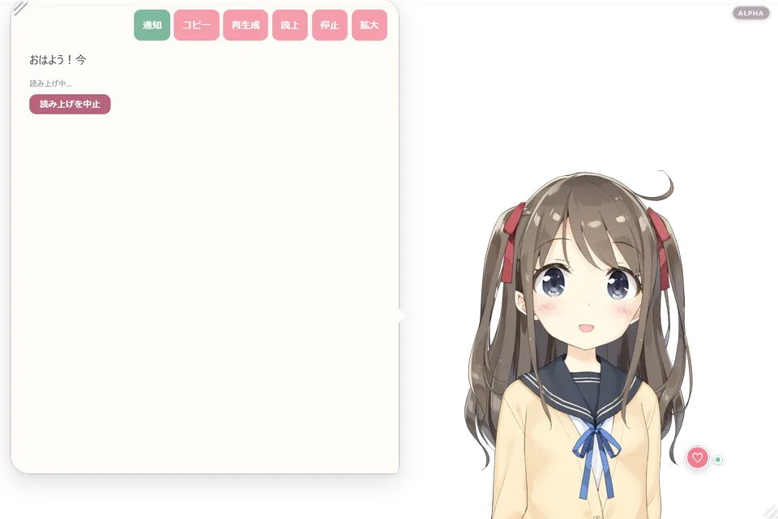
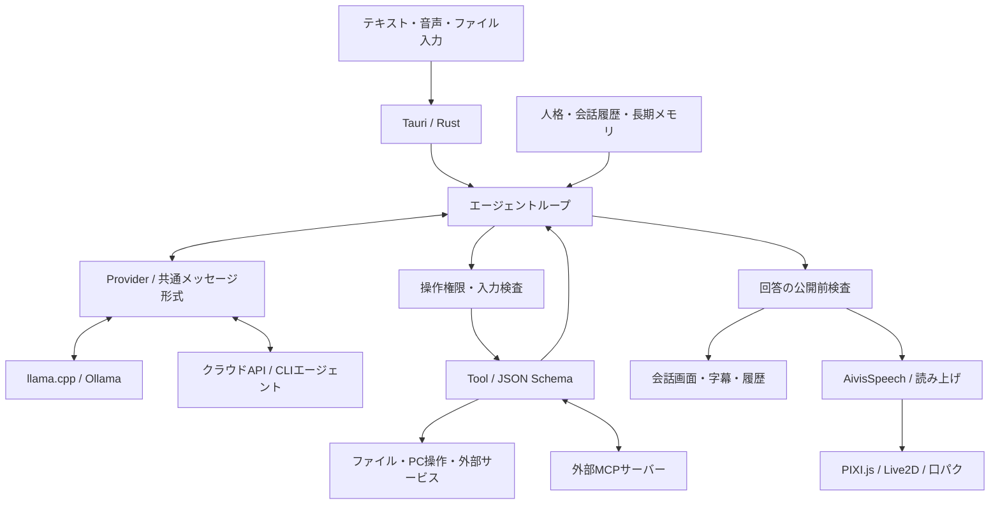

# PicoAgent

**会話・写真や画面の読み取り・PC操作・音声・独自2.5D／Live2D／MMDモデルの表示を統合した、Rust / Tauri製のデスクトップAIエージェント。**

自然言語の依頼をモデルの応答とツール実行のループへ接続し、PC上の作業まで扱うアプリです。独自2.5D、Live2D、MMDのキャラクターを表示し、会話の読み上げに合わせて口パクや表情を動かします。LLMの接続先を差し替える共通インターフェース、複数AIの協調、ローカル推論エンジンの管理、操作権限とデータ保護、常駐UIを一つの製品へ組み込んでいます。

[公式ページ](https://benybeny777.github.io/PicoAgent-Distribution/) · [ダウンロード](https://github.com/benybeny777/PicoAgent-Distribution/releases) · [不具合報告](https://github.com/benybeny777/PicoAgent-Distribution/issues)

| 2D / 2.5D | Live2D |
|---|---|
|  |  |

このリポジトリは配布物・公開サイト・技術概要を公開する場所です。アプリ本体のソースコードは非公開です。技術概要の確認日: **2026-10-05**。対象は本体の開発版 **1.2.19**です。以下の設計説明は本体の開発版を対象とし、公開インストーラーに含まれる機能とは区別しています。配布版の情報は[Releases](https://github.com/benybeny777/PicoAgent-Distribution/releases)と`latest.json`を参照してください。

## 技術的な取り組み

| 領域 | 実装・設計 |
|---|---|
| AIエージェント | function callingによる複数段のツール実行、計画生成・自己評価、ステップ上限、中断、再試行、使用量・実行時間の記録 |
| モデル接続 | ローカル推論、Ollama、クラウドAPI、CLIエージェントを共通の`Provider`インターフェースとメッセージ形式へ変換 |
| ツール拡張 | 75種の組み込みツール、JSON Schemaと`Tool`による登録、設定項目の宣言、MCP連携、利用者追加のMarkdownスキル |
| 複数AI | 合議、担当別の分担、結果の統合。ローカル推論の競合を避ける直列実行と、その他の接続先の並行数制御 |
| ローカル実行基盤 | llama.cppの子プロセス管理、モデル取得、GPUバックエンド選択、取得資産のハッシュ検証 |
| 写真・画面の読み取り | 写真やスクリーンショットを添付して、内容の説明や文字の読み取りを依頼。Gemma 4 E2BでPC内処理 |
| 音声・描画 | whisper.cpp、AivisSpeech、母音口パク、独自2.5D・Live2D・MMDの描画 |
| 信頼性 | 状態更新の排他制御、破損データの退避、秘密値保護、設計上の制約を固定する回帰検査 |

## アーキテクチャ


```mermaid
flowchart TB
  INPUT["テキスト・音声・ファイル入力"] --> APP["Tauri / Rust"]
  APP --> AGENT["エージェントループ"]
  CONTEXT["人格・会話履歴・長期メモリ"] --> AGENT
  AGENT <--> PROVIDER["Provider / 共通メッセージ形式"]
  PROVIDER <--> LOCAL["llama.cpp / Ollama"]
  PROVIDER <--> REMOTE["クラウドAPI / CLIエージェント"]
  AGENT --> POLICY["操作権限・入力検査"]
  POLICY --> TOOL["Tool / JSON Schema"]
  TOOL --> RESULT["ファイル・PC操作・外部サービス"]
  TOOL <--> MCP["外部MCPサーバー"]
  TOOL --> AGENT
  AGENT --> CHECK["回答の公開前検査"]
  CHECK --> UI["会話画面・字幕・履歴"]
  CHECK --> VOICE["AivisSpeech / 読み上げ"]
  VOICE --> CHARACTER["PIXI.js / Live2D / 口パク"]
```

### 1. モデルと実行能力を分離する

エージェントループは、プロバイダ固有のAPI形式を直接扱いません。会話・ツール呼び出し・実行結果を共通メッセージへ正規化し、各`Provider`が接続先の形式へ変換します。OpenAI互換API、Claude、Geminiなどで異なる応答形式を、この境界で吸収します。

実行能力は別の`Tool`インターフェースが持ちます。名前・説明・引数のJSON Schema・実行処理を登録し、設定項目は`config_schema()`で宣言します。接続先の追加とツールの追加を分離し、モデルを変更してもアプリ側の操作権限を共通に保つ設計です。

CLIエージェントはネイティブのfunction callingと同じ扱いにはできないため、応答JSONをツール呼び出しへ変換します。CLI側の実行能力を制限し、ファイルやPC操作はPicoAgentのツール境界を通します。この経路は通常のAPI接続よりツール呼び出しの取りこぼしがありえます。

### 2. ツール実行を制御可能なループにする

基本の流れは「モデル呼び出し → ツール呼び出し → 結果を会話へ追加 → モデル呼び出し」です。複数のツール呼び出しは並行実行し、ステップ上限と中断処理で実行を制御します。プロバイダの一時的な失敗は指数バックオフ付きで再試行し、認証・パラメータ不正は再試行せず返します。

複雑な依頼には計画生成と自己評価を組み合わせ、複数AIでは同じ依頼への合議、担当別の分担、まとめ役による統合を扱います。同梱ローカルAI同士は直列化し、それ以外は並行数に上限を設けます。協調実行は単一モデルより応答時間とAPI利用量が増えるため、用途に応じて選ぶ機能です。

### 3. ローカルAIをアプリの実行基盤として管理する

llama.cppを独立した推論プロセスとして起動し、アプリが起動確認と終了処理を管理します。GGUFモデルを使い、初回取得後のローカル会話はPC内で処理できます。Web検索や外部サービス、クラウドモデルを選んだ場合は通信が発生します。

開発版のWindowsではGPUに応じてCUDA／ROCm／SYCL、Vulkan、CPUの候補を起動確認します。候補の存在だけで利用可能と扱わず、対象環境と実際の起動結果を確認する設計です。大容量の追加モデル・ランタイムは明示的に選んだ機能だけを導入し、通常の開発起動や軽量ビルドへ一括取得を混ぜません。

取得資産はSHA-256で照合し、管理情報と実体を対応付けます。設定・会話履歴・追加キャラ・モデルを保持する更新経路を設け、子プロセスや取得途中のファイルも管理対象にしています。

### 4. AIの出力と利用者データの境界を守る

- **操作権限**: ファイル操作の許可ルートを限定し、削除相当はOSのゴミ箱へ移します。PC操作・ブラウザ操作・ローカルAPI・MCPは既定で無効です。
- **外部入力**: ツール結果や添付本文を非信頼入力として扱い、プロンプトインジェクションの検査を行います。この検査だけで攻撃を完全に防げるとは扱いません。
- **公開する回答**: モデルの生チャンクをそのまま画面へ出さず、内部資料や非公開文脈の混入を検査した本文を画面・音声・履歴で共有します。即時表示より公開前検査を優先する設計です。
- **状態の整合性**: 一覧の「読み込み → 更新 → 保存」を状態ごとのロックで直列化します。破損した保存データは退避し、設定内の一覧を読めない場合は空一覧で上書きせずエラーにします。多重起動も防ぎます。
- **秘密値とAPI**: WindowsのAPIキー等はDPAPIで保護します。ローカルHTTP APIは`127.0.0.1`へ限定し、Bearer認証に対応します。開発版ではOriginとJSON Content-Typeも検査します。

### 5. 生成工程と常駐描画を分離する

付属7体の2D／2.5Dキャラクターは、LocalVTuberStudioで立ち絵を部位分解・局所補完した素材を使います。制作側のPython・PyTorchと、実行側のRust・JavaScriptを分離し、表示中は画像生成モデルを動かしません。

```text
立ち絵 → 背景分離 → DINO / SAMによる部位分解 → 2.5Dリグ化
       → Qwen / ComfyUIによる局所補完
       → character.json + PNGパーツ
       → 共通PIXI描画 → まばたき・母音口パク・視線・表情
```

各工程の成果物を保存し、失敗した工程以降だけを再実行できます。原画は上書きせず、未完成の素材を正常な素材として表示しません。任意の入力画像で同じ品質になる保証はまだありません。Live2Dは利用者が権利を持つCubism 4／5モデルの読み込みに対応し、モデル素材は配布物に同梱しません。


### 6. 写真やスクリーンショットをAIに見せる

チャットに写真やスクリーンショットを添付し、「この写真に何が写っている？」「画面のエラー文を読んで」と頼めます。添付した画像を読み取るAIとしてGemma 4 E2Bを使い、画像と質問をPC内で処理します。細かな文字や数値は読み違える場合があるため、結果の確認が必要です。

この機能を有効にするときは、画像を読み取るための追加モデルデータ（約0.99GB）を取得します。会話に添付した画像の読み取りと、ゲーム画面の読み取りで同じデータを再利用します。画像を新しく作る「画像生成」や、画像を書き換える「画像編集」には、それぞれ別のモデルと導入条件があります。

### 7. MMDモデルの表示と画面を見ながらの操作

MMDは利用者が権利を持つPMX 2.0モデルをZIP／フォルダから登録し、待機姿勢・ポーズ・表情・まばたき・口パクを描画します。髪や衣服の揺れをPMXの剛体・制約で計算する物理演算は未対応です。ゲーム操作は画面認識から1操作を選び結果を確認する初期実装で、不明な認識や画面変化では停止します。実ゲームでの安定動作や1フロア探索は未確認です。

### 8. 利用者の手順と画面配置を保存する

利用者は`SKILL.md`に手順を書いて、次の会話から利用できます。Markdownはモデルへ渡す指示データであり、新しい実行権限や任意コードを追加しません。実行は既存のツールとその権限境界を通します。

公開する表示形式はミニ・ペット・配信の3形式です。OBS風の直接配置を行い、確定した位置・大きさをキャラと形式ごとに保存します。以前の形式の保存値は保持します。

## 技術スタック

| 領域 | 技術 | 用途 |
|---|---|---|
| アプリ・非同期処理 | Rust、Tauri 2、Tokio | ウィンドウ、状態、権限、通信、外部プロセスの管理 |
| UI | HTML、CSS、JavaScript、WebView2（Windows） | 会話、設定、配信表示、実行状況の表示 |
| LLM・画像入力 | llama.cpp、GGUF、Gemma 4 E2B、各社API | ローカル／クラウド推論、ツール呼び出し、画像認識 |
| 相互接続 | JSON Schema、MCP、OpenAI互換HTTP API | ツール定義、外部ツール利用、アプリ機能の公開 |
| 音声 | whisper.cpp、AivisSpeech | 端末内の文字起こし、読み上げ、口パク用の母音時間 |
| キャラクター描画 | PIXI.js、独自メッシュリグ、Cubism Core、pixi-live2d-display、MMD描画ランタイム | 2D／2.5D／Live2D／PMXモデルの描画 |
| キャラクター制作 | Python 3.12、PyTorch、Grounding DINO、SAM 2.1、ComfyUI、Qwen-Image-Edit | 原画の解析、部位分解、局所補完 |
| 検証・配布 | Cargo、cargo xtask、Node.js、Playwright、NSIS | 静的解析、回帰検査、画面検証、Windowsインストーラー生成 |

## 検証と現在の境界

本体の`cargo xtask verify`に、書式・全targetの静的解析・テスト・JavaScript構文・画面の契約テスト・Git差分検査をまとめています。設定キーと文書の対応、状態更新のロック、破損時の退避、回答の公開前検査など、設計上守るべき制約も機械検査の対象です。依存変更時は`cargo audit`で既知脆弱性を確認します。

静的検査やロジックテストだけでは、Windows WebView2での表示、マイク入力、音声の聴感、GPU推論、クリーン環境へのインストールは保証できません。これらは実機受入として分けて確認します。現時点ではアルファ版であり、全環境での動作・素材品質・正式配布の署名は受入を進める対象です。性能の数値は、このREADMEでは未計測の値を掲載しません。

## 公開アルファ版

| 区分 | 確認した状態（2026-10-05） |
|---|---|
| 本体の開発版 | 1.2.19。上記の技術概要の対象 |
| 公開Windows版 | 1.1.5 Alpha。Windows 10／11 x64、インストーラー121.30 MB |
| 公開macOS版 | 1.0.4 Alpha。開発版と機能・検証状態が異なる |

公開版は開発版より前の版です。上記の75種のツール、3つの表示形式、画像入力など、開発版の仕様がすべて公開版へ含まれるとは限りません。プレビュー画像も公開版向けに用意した動作例であり、最新開発版の画面を保証するものではありません。

アルファ版は無料で試用できます。外部APIの利用料は別途発生します。Windows版は未署名、macOS版は署名・公証前です。配布ファイルと版ごとの情報は[Releases](https://github.com/benybeny777/PicoAgent-Distribution/releases)を確認してください。

1. Releasesから対象OSのインストーラーを取得します。
2. 初回画面で用途と追加機能を選び、ローカルAIを使う場合はモデルを取得します。
3. モデル取得後のローカル会話はオフラインで利用できます。Web検索・外部連携には通信が必要です。

必要なRAM・VRAM・空き容量はモデルと機能によって変わります。開発版の既定会話モデルはLFM2.5 2.6B QAD Q4（約1.59GB）です。この容量を旧公開版の初回取得容量として扱わないでください。

詳しい利用案内は[公式ページ](https://benybeny777.github.io/PicoAgent-Distribution/)を参照してください。不具合報告には版と再現手順を添え、APIキー・会話全文・個人ファイルを掲載しないでください。

## この公開リポジトリについて

公開サイトの正本はこのリポジトリの`main`です。GitHub Pagesのワークフローが静的ファイルを配信します。アプリ本体のソースコードは含みません。技術概要、動作プレビュー、Releasesの配布物を公開しています。
